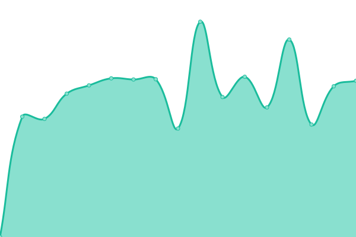

# [📈 Live Status](https://status.lxnchan.cn): <!--live status--> **🟧 Partial outage**

This repository contains the open-source uptime monitor and status page for [泠泫凝](https://LxnChan.cn), powered by [Upptime](https://github.com/upptime/upptime).

With [Upptime](https://upptime.js.org), you can get your own unlimited and free uptime monitor and status page, powered entirely by a GitHub repository. We use [Issues](https://github.com/LxnChan/status/issues) as incident reports, [Actions](https://github.com/LxnChan/status/actions) as uptime monitors, and [Pages](https://status.lxnchan.cn) for the status page.

<!--start: status pages-->
<!-- This summary is generated by Upptime (https://github.com/upptime/upptime) -->
<!-- Do not edit this manually, your changes will be overwritten -->
<!-- prettier-ignore -->
| URL | Status | History | Response Time | Uptime |
| --- | ------ | ------- | ------------- | ------ |
|  [Google](https://www.google.com) | 🟩 Up | [google.yml](https://github.com/LxnChan/status/commits/HEAD/history/google.yml) | 

 110ms
     
 | 

<a href="https://status.lxnchan.cn/history/google">100.00%</a>
    

|  [Baidu（百度）](https://www.baidu.com) | 🟩 Up | [baidu.yml](https://github.com/LxnChan/status/commits/HEAD/history/baidu.yml) | 

 2344ms
     
 | 

<a href="https://status.lxnchan.cn/history/baidu">100.00%</a>
    

|  [Official（泠泫凝的异次元空间-主页）](https://lxnchan.cn) | 🟥 Down | [official.yml](https://github.com/LxnChan/status/commits/HEAD/history/official.yml) | 

 1695ms
     
 | 

<a href="https://status.lxnchan.cn/history/official">64.06%</a>
    

|  [115Wiki](https://115.anavi.cn) | 🟥 Down | [115-wiki.yml](https://github.com/LxnChan/status/commits/HEAD/history/115-wiki.yml) | 

 0ms
     
 | 

<a href="https://status.lxnchan.cn/history/115-wiki">0.00%</a>
    

|  [EnderChest（末影箱-云盘）](https://enderchest.anavi.cn) | 🟥 Down | [ender-chest.yml](https://github.com/LxnChan/status/commits/HEAD/history/ender-chest.yml) | 

 1236ms
     
 | 

<a href="https://status.lxnchan.cn/history/ender-chest">57.48%</a>
    

|  [Gravtar代理](https://gravatar.arlxn.top) | 🟩 Up | [gravtar.yml](https://github.com/LxnChan/status/commits/HEAD/history/gravtar.yml) | 

 250ms
     
 | 

<a href="https://status.lxnchan.cn/history/gravtar">100.00%</a>
    

<!--end: status pages-->

[**Visit our status website →**](https://status.lxnchan.cn)

## 📄 License

- Powered by: [Upptime](https://github.com/upptime/upptime)
- Code: [MIT](./LICENSE) © [泠泫凝](https://LxnChan.cn)
- Data in the `./history` directory: [Open Database License](https://opendatacommons.org/licenses/odbl/1-0/)
