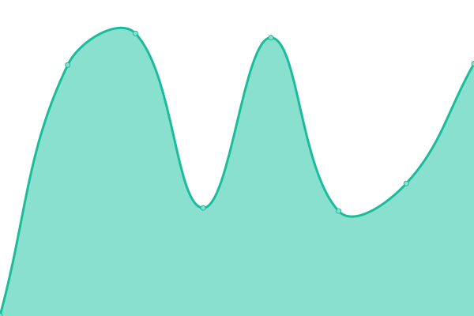
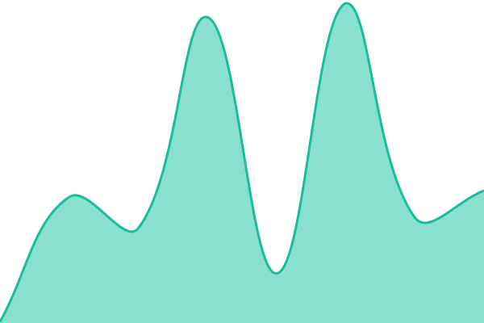
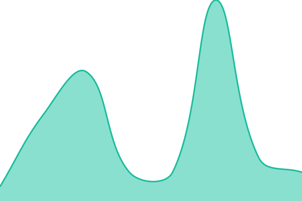

# [📈 Live Status](https://status.lxnchan.cn): <!--live status--> **所有系统运行正常**

This repository contains the open-source uptime monitor and status page for [泠泫凝](https://LxnChan.cn), powered by [Upptime](https://github.com/upptime/upptime).

With [Upptime](https://upptime.js.org), you can get your own unlimited and free uptime monitor and status page, powered entirely by a GitHub repository. We use [Issues](https://github.com/LxnChan/status/issues) as incident reports, [Actions](https://github.com/LxnChan/status/actions) as uptime monitors, and [Pages](https://status.lxnchan.cn) for the status page.

<!--start: status pages-->
<!-- This summary is generated by Upptime (https://github.com/upptime/upptime) -->
<!-- Do not edit this manually, your changes will be overwritten -->
<!-- prettier-ignore -->
| 网址 | 状态 | 历史记录 | 响应时间 | 正常运行时间 |
| --- | ------ | ------- | ------------- | ------ |
|  [泠泫凝的异次元空间 - blog主页](https://lxnchan.cn) | 正常 | [blog.yml](https://github.com/LxnChan/status/commits/HEAD/history/blog.yml) | 

 1805毫秒
     
 | 

<a href="https://status.lxnchan.cn/history/blog">100.00%</a>
    

|  [Comment Service - 评论服务](https://comment.lxnchan.cn) | 正常 | [comment-service.yml](https://github.com/LxnChan/status/commits/HEAD/history/comment-service.yml) | 

 1096毫秒
     
 | 

<a href="https://status.lxnchan.cn/history/comment-service">100.00%</a>
    

|  [OSS](https://bucket.lxnchan.cn/robots.txt) | 正常 | [oss.yml](https://github.com/LxnChan/status/commits/HEAD/history/oss.yml) | 

 841毫秒
     
 | 

<a href="https://status.lxnchan.cn/history/oss">100.00%</a>
    

|  [Gravtar代理](https://gravatar.arlxn.top) | 正常 | [gravtar.yml](https://github.com/LxnChan/status/commits/HEAD/history/gravtar.yml) | 

 285毫秒
     
 | 

<a href="https://status.lxnchan.cn/history/gravtar">100.00%</a>
    

|  [Cloudflare Quad1 DNS](1.1.1.1) | 正常 | [cloudflare-quad1-dns.yml](https://github.com/LxnChan/status/commits/HEAD/history/cloudflare-quad1-dns.yml) | 

 5毫秒
     
 | 

<a href="https://status.lxnchan.cn/history/cloudflare-quad1-dns">100.00%</a>
    

|  [Google Play](https://play.google.com) | 正常 | [google-play.yml](https://github.com/LxnChan/status/commits/HEAD/history/google-play.yml) | 

 417毫秒
     
 | 

<a href="https://status.lxnchan.cn/history/google-play">100.00%</a>
    

|  [Baidu - 百度](https://www.baidu.com) | 正常 | [baidu.yml](https://github.com/LxnChan/status/commits/HEAD/history/baidu.yml) | 

 2464毫秒
     
 | 

<a href="https://status.lxnchan.cn/history/baidu">99.24%</a>
    

|  [bilibili](https://api.bilibili.com) | 正常 | [bilibili.yml](https://github.com/LxnChan/status/commits/HEAD/history/bilibili.yml) | 

 1469毫秒
     
 | 

<a href="https://status.lxnchan.cn/history/bilibili">100.00%</a>
    

<!--end: status pages-->

[**Visit our status website →**](https://status.lxnchan.cn)

## 📄 License

- Powered by: [Upptime](https://github.com/upptime/upptime)
- Code: [MIT](./LICENSE) © [泠泫凝](https://LxnChan.cn)
- Data in the `./history` directory: [Open Database License](https://opendatacommons.org/licenses/odbl/1-0/)
